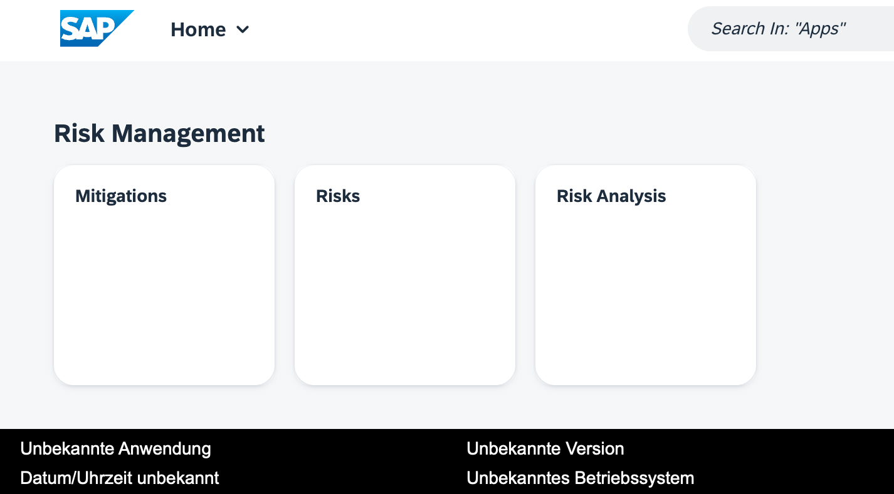

# Deploying an App to SAP Business Technology Platform (SAP BTP)

Initialize a new project

```zsh
nvm use 16
node -v > .nvmrc
cds init
npm i sqlite
```

# Getting Started

Welcome to your new project.

It contains these folders and files, following our recommended project layout:

| File or Folder | Purpose                              |
| -------------- | ------------------------------------ |
| `app/`         | content for UI frontends goes here   |
| `db/`          | your domain models and data go here  |
| `srv/`         | your service models and code go here |
| `package.json` | project metadata and configuration   |
| `readme.md`    | this getting started guide           |

## Next Steps

- Open a new terminal and run `cds watch`
- (in VS Code simply choose _**Terminal** > Run Task > cds watch_)
- Start adding content, for example, a [db/schema.cds](db/schema.cds).

## Learn More

Learn more at https://cap.cloud.sap/docs/get-started/.

## Connect to Cloud Foundry

```zsh
❯ cf api https://api.cf.us10-001.hana.ondemand.com
Setting API endpoint to https://api.cf.us10-001.hana.ondemand.com...
OK

API endpoint:   https://api.cf.us10-001.hana.ondemand.com
API version:    3.134.0

Not logged in. Use 'cf login' or 'cf login --sso' to log in.
```

```zsh
❯ cf login
API endpoint: https://api.cf.us10-001.hana.ondemand.com

Email: mail@example.com
Password:

Authenticating...
OK

Targeted org mytrialorg

Targeted space dev.

API endpoint:   https://api.cf.us10-001.hana.ondemand.com
API version:    3.134.0
user:           mail@example.com
org:            mytrialorg
space:          dev
```

## Adding SAP HANA as database

```zsh
cds add hana --for production
```

### Restart SAP HANA DB

Your SAP HANA Cloud service instance will be automatically stopped overnight, according to the server region time zone. That means you need to restart your instance every day before you start working with it.

You can either use SAP BTP cockpit or the Cloud Foundry CLI to restart the stopped instance:

```zsh
cf update-service cpapp -c '{"data":{"serviceStopped":false}}'
```

## Adding Authorization and Trust Management

```zsh
cds add xsuaa --for production
```

## Adding Multi-Target-Application Packer

```zsh
npm install --global mbt
mbt --version
```

## Add Cloud Foundry Plugin: MultiApps

```zsh
cf plugins
cf install-plugin multiapps
Searching CF-Community for plugin multiapps...
Plugin multiapps 3.0.2 found in: CF-Community
Attention: Plugins are binaries written by potentially untrusted authors.
Install and use plugins at your own risk.
Do you want to install the plugin multiapps? [yN]: y
Starting download of plugin binary from repository CF-Community...
 15.22 MiB / 15.22 MiB [===========================================================================================================] 100.00% 1s
Installing plugin multiapps...
OK

Plugin multiapps 3.0.2 successfully installed.
```

## Add Cloud Foundry Node.JS Engine

package.json

```json
  "engines": {
    "node": "^16"
  },
```

## Prepare Multi-Target Application

```zsh
cds add mta
Adding feature(s) to project in current folder

Adding feature 'mta'...
Done adding features
```

## Building Multi-Target-Archive MTAR file for deployment

```zsh
mbt build -t ./
cf deploy cpapp2_1.0.0.mtar

cf services
cf apps
```

## Deploying MTAR to SAP BTP Cloud Foundry environment

```zsh
Deploying multi-target app archive cpapp2_1.0.0.mtar in org mytargetorg / space dev as tobias.klemmermail@example.com...

Uploading 1 files...
  /Users/toby/code/sap/cap/training/cpapp2/cpapp2_1.0.0.mtar
OK
Operation ID: af60ef88-ff9c-11ed-a738-eeee0a8a7226
Deploying in org "mytargetorg" and space "dev"
Detected MTA schema version: "3"
No deployed MTA detected - this is initial deployment of MTA with ID "cpapp2"
Detected new MTA version: "1.0.0"
Processing service "cpapp2-uaa"...
Setting service "cpapp2-uaa" parameters from "xs-security.json"
Processing service "cpapp2-db"...
Creating service "cpapp2-db" from MTA resource "cpapp2-db"...
Creating service "cpapp2-uaa" from MTA resource "cpapp2-uaa"...
0 of 1 done, (1 creating)
1 of 1 done
0 of 1 done, (1 creating)
0 of 1 done, (1 creating)
0 of 1 done, (1 creating)
0 of 1 done, (1 creating)
0 of 1 done, (1 creating)
1 of 1 done
Creating application "cpapp2-db-deployer" from MTA module "cpapp2-db-deployer"...
Creating application "cpapp2-srv" from MTA module "cpapp2-srv"...
Binding service instance "cpapp2-db" to application "cpapp2-db-deployer"...
Binding service instance "cpapp2-db" to application "cpapp2-srv"...
Binding service instance "cpapp2-uaa" to application "cpapp2-srv"...
Uploading application "cpapp2-db-deployer"...
Uploading application "cpapp2-srv"...
Started async upload of application "cpapp2-srv"
Started async upload of application "cpapp2-db-deployer"
Staging application "cpapp2-db-deployer"...
Staging application "cpapp2-srv"...
Application "cpapp2-srv" staged
Starting application "cpapp2-srv"...
Application "cpapp2-srv" started and available at "mytargetorg-dev-cpapp2-srv.cfapps.us10-001.hana.ondemand.com"
Application "cpapp2-db-deployer" staged
Executing task "deploy" on application "cpapp2-db-deployer"...
Skipping deletion of services, because the command line option "--delete-services" is not specified.
Process finished.
Use "cf dmol -i af60ef88-ff9c-11ed-a738-eeee0a8a7226" to download the logs of the process.
```

## Prepare Frontend Apps for deployment

```zsh
npm install --global @sap/ux-ui5-tooling
npm install --global @sap/generator-fiori
npm install --global mta
```

### Add Deployment Config for Risks App

```zsh
cd app/risks
fiori add deploy-config cf

Adding deploy-config to the project.
info Add:Deploy-config Using: @sap/fiori:deploy-config
? Destination name cpapp2-app-srv
? Editing the deployment configuration will overwrite existing configuration, are you sure you want to continue? Yes
Adding app to mta config: nsrisks
Updating mta.yaml with module information
   create xs-app.json
   create ui5-deploy.yaml

No change to package.json was detected. No package manager install will be executed.
npm WARN config cache-min This option has been deprecated in favor of `--prefer-offline`.
npm WARN deprecated @npmcli/move-file@1.1.2: This functionality has been moved to @npmcli/fs

added 183 packages, removed 32 packages, changed 2 packages, and audited 288 packages in 2s

25 packages are looking for funding
  run `npm fund` for details

found 0 vulnerabilities
```

### Add Deyployment Config for Mitigations App

```zsh
cd ../../app/mitigations
fiori add deploy-config cf
Adding deploy-config to the project.
info Add:Deploy-config Using: @sap/fiori:deploy-config
? Destination name cpapp2-app-srv
? Editing the deployment configuration will overwrite existing configuration, are you sure you want to continue? Yes
Adding app to mta config: nsmitigations
Updating mta.yaml with module information
   create xs-app.json
   create ui5-deploy.yaml

No change to package.json was detected. No package manager install will be executed.
npm WARN config cache-min This option has been deprecated in favor of `--prefer-offline`.

up to date, audited 288 packages in 525ms

25 packages are looking for funding
  run `npm fund` for details

found 0 vulnerabilities
```

### Enhance .gitignore to not store generated folders

.gitignore

```zsh
dist/
resources/
app/*/package-lock.json
```

## Re-deploy

```zsh
cd ../..
mbt build -t ./
cf deploy cpapp2_1.0.0.mtar

Deploying multi-target app archive cpapp2_1.0.0.mtar in org mytargetorg / space dev as tobias.klemmermail@example.com...

Uploading 1 files...
  /Users/toby/code/sap/cap/training/cpapp2/cpapp2_1.0.0.mtar
OK
Operation ID: 7c3b0169-ffa2-11ed-aa3d-eeee0a869207
Deploying in org "mytargetorg" and space "dev"
Detected MTA schema version: "3"
Detected deployed MTA with ID "cpapp2" and version "1.0.0"
Detected new MTA version: "1.0.0"
Deployed MTA version: "1.0.0"
Processing service "cpapp2-uaa"...
Setting service "cpapp2-uaa" parameters from "xs-security.json"
Processing service "cpapp2-html5-repo-host"...
Creating service "cpapp2-html5-repo-host" from MTA resource "cpapp2-html5-repo-host"...
Processing service "cpapp2-db"...
Updating service "cpapp2-uaa"...
Processing service "cpapp2-destination"...
Creating service "cpapp2-destination" from MTA resource "cpapp2-destination"...
1 of 1 done
1 of 1 done
1 of 1 done
Updating application "cpapp2-srv"...
Application "cpapp2-srv" attributes are not modified and will not be updated
Updating application "cpapp2-db-deployer"...
Application "cpapp2-db-deployer" attributes are not modified and will not be updated
Creating service key "cpapp2-app-content-cpapp2-html5-repo-host-credentials" for service instance "cpapp2-html5-repo-host"...
Creating service key "cpapp2-html5-repo-host-key" for service instance "cpapp2-html5-repo-host"...
Creating service key "cpapp2-destinations-cpapp2-destination-credentials" for service instance "cpapp2-destination"...
Creating service key "cpapp2-uaa-key" for service instance "cpapp2-uaa"...
Uploading content module "cpapp2-app-content" in target service "cpapp2-html5-repo-host"...
Deploying content module "cpapp2-destinations" in target service "cpapp2-destination"...
Deploying content module "cpapp2-app-content" in target service "cpapp2-html5-repo-host"...
Unbinding service instance "cpapp2-db" from application "cpapp2-srv"...
Unbinding service instance "cpapp2-db" from application "cpapp2-db-deployer"...
Unbinding service instance "cpapp2-uaa" from application "cpapp2-srv"...
Binding service instance "cpapp2-db" to application "cpapp2-srv"...
Binding service instance "cpapp2-db" to application "cpapp2-db-deployer"...
Binding service instance "cpapp2-uaa" to application "cpapp2-srv"...
Uploading application "cpapp2-db-deployer"...
Started async upload of application "cpapp2-db-deployer"
Scaling application "cpapp2-db-deployer" to "1" instances...
Uploading application "cpapp2-srv"...
Staging application "cpapp2-db-deployer"...
Started async upload of application "cpapp2-srv"
Stopping application "cpapp2-srv"...
Staging application "cpapp2-srv"...
Application "cpapp2-srv" staged
Starting application "cpapp2-srv"...
Application "cpapp2-db-deployer" staged
Application "cpapp2-srv" started and available at "mytargetorg-dev-cpapp2-srv.cfapps.us10-001.hana.ondemand.com"
Executing task "deploy" on application "cpapp2-db-deployer"...
Skipping deletion of services, because the command line option "--delete-services" is not specified.
Process finished.
Use "cf dmol -i 7c3b0169-ffa2-11ed-aa3d-eeee0a869207" to download the logs of the process.
```

## Build Workzone Navigation

Each app requires a section in its webapp/manifest.json with its display name and Semantic Object. Otherwise you cannot assign it to a Group in the Launchpad.

```json
...
    "crossNavigation": {
      "inbounds": {
        "Risks-Analysis-display": {
          "signature": {
            "parameters": {},
            "additionalParameters": "allowed"
          },
          "semanticObject": "RisksAnalysis",
          "action": "display"
        }
      }
    },
...
```

After each change and deployment go to the Build Workzone "Content Channel Manager" and do a Content Refresh. Looks like it caches the content.

In the Content Manager press "Discover" to add the app to the List.

The Apps need to be assigned to the Everyone, otherwise it doesn't appear in the Catalogue.

Add the App to the Group to get it visible in the Launchpad.



## Undeploy App

```zsh
cf undeploy cpapp2 --delete-service-keys --delete-services
cf undeploy cpapp
```
